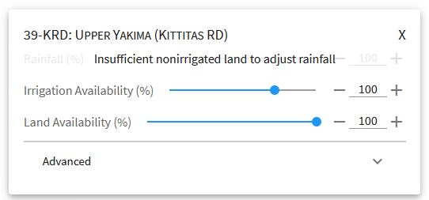
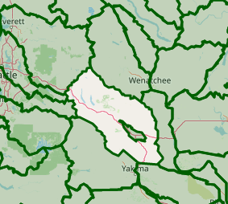
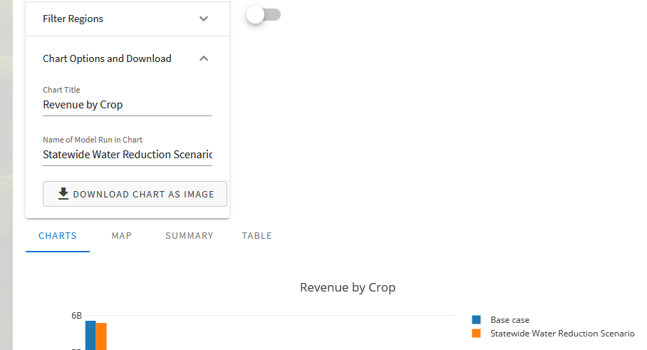

Visual Changelog - May 2021
============================

.. toctree::
   :maxdepth: 1
   :caption: OpenAg Changes for May 2021:

Better Communication of Disabled Region Adjustments
----------------------------------------------------

    Previously, when a model area supported an adjustment, such as rainfall or irrigation,
    but the region didn't support it, the slider would disappear from that region's card,
    creating confusion. Now the card disables the slider and displays text overlaying the
    slider explaining why the slider is disabled.

Removal of Regions with Disabled Sliders from Map
----------------------------------------------------

    When we disable a slider (such as for rainfall in the above example), the region
    will also be removed from the map on the page when viewing the cumulative input
    modifications. It does not currently remove a region that doesn't support rainfall
    or irrigation until it has a card created for modifications. That is, if a region
    doesn't support rainfall, it'll still show on the map with the all crops changes
    until a card is added for the region.

New Chart Options: Set Title and Model Run Name
-------------------------------------------------

    OpenAg includes a new section to define basic information for the chart, to allow for more useful
    exports of charts to use in reports. Options include a chart title and renaming the legend entry
    for the model run in the chart (default is "This model run"). The download button for the chart has
    been moved into this section to allow for setting chart options and exporting in one spot.