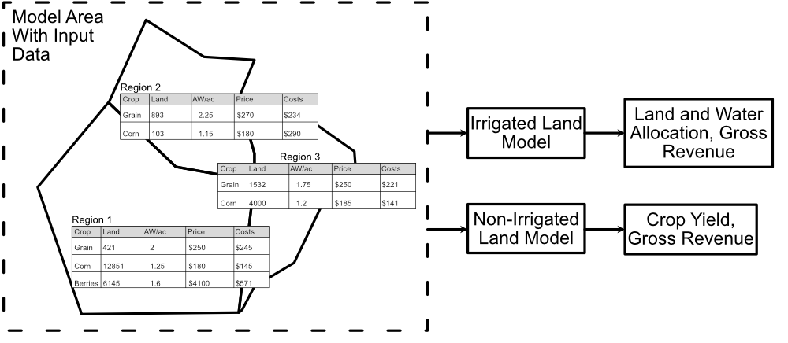

How the Model Works
====================
OpenAg is composed of two separate models for irrigated and nonirrigated
lands. Each of these models operates on distinct Model Areas, which provide
the suite of inputs, region definitions, crop data, and more required to
run OpenAg's models. This section provides information on how the models
in OpenAg work and the Model Areas that they work with.

.. _model_area_diagram_figure:

    A diagram of OpenAg's input data and model relationships. Each model area has many regions with independent data.
    Each region runs as an independent model, but OpenAg runs all regions through both models simultaneously.

Each model area in OpenAg contains many regions with their own data (:numref:`model_area_diagram_figure`) for

#. What crops are grown there,
#. How much it costs to grow them,
#. Applied Water (AW), or irrigated water, used in growing them,
#. Expected prices and yields,
#. And more.

OpenAg runs each region as an independent model, with their own input data and results. Regions with irrigated
land will utilize OpenAg's :ref:`irrigated land crop choice model <IrrigatedPMPDoc>` to estimate land use decisions and regions with
nonirrigated crops will also utilize OpenAg's :ref:`statistical regression model <NonIrrigatedDoc>` to estimate yields based on seasonal rainfall.

Please see the following articles for additional details on how these models work.

.. todo:: Describe model and data relationships briefly in text

.. toctree::
    :maxdepth: 2
    :caption: Contents

    available_models.rst
    ../ModelAreas/model_areas.rst
    input_data.rst
    irrigated_pmp.rst
    nonirrigated.rst
    linear_scaling.rst
    outputs.rst
    model_limitations.rst
    irrigated_nonirrigated_data_split.rst
