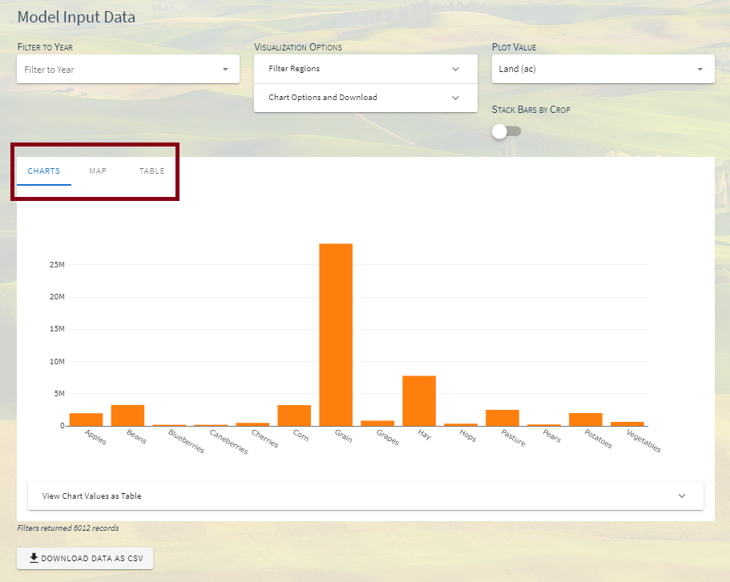

Viewing Model Input Data
===========================

When working with the model input data portion of the application, viewing data in various charts and tables could be used to represent the data in a more coherent method.
The application offers 3 different types of methods users can display their data: charts, map, and a table option. Tables (csv) are directly downloadable items.

.. todo::
    note somewhere that input data is not the same as the calibrated data that we use for model runs