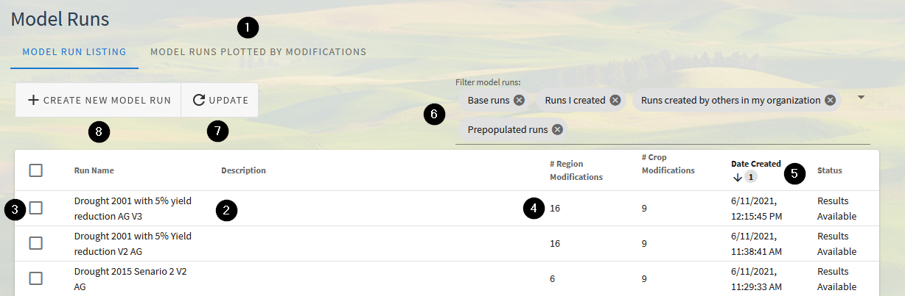

.. index::
    single: model run; find
    single: model run; filter
    single: model run; list

.. _FindingModelRunsDoc:

Finding Model Runs You've Created
===================================

.. _FindingModelRunsOverviewSection:

Overview
----------------
When running the |project_name| model, your inputs and results are saved as a Model Run in the application that you can
access at any point in the future. By default, all model runs from users in the same organization are visible to other
users in the organization, allowing for cross-collaboration and sharing of model runs to support decision-making.

Opening Model Runs
---------------------------------
Model runs can be accessed via the "View Existing Model Runs" button on the home page, or in the navigation bar
by clicking "Model Runs". The page to view model runs includes multiple features to help find a specific model run.
The main Model Runs page, separated into two tabs for listing or plotting, has several features to help identify and
compare completed model runs.

1. By default the application shows you a table of model runs along with some basic metadata. The "Model Runs Plotted By Modifications" tab near the top of the page opens a scatterplot view that shows model runs based on the overall impact of their inputs
2. To open a model run, click on any model run in the table, which will :ref:`bring up the model run's inputs and results <ModelRunDoc>`.
3. Model runs may also be permanently deleted using this page by using the checkboxes to the left of model runs. If model runs are checked, then a delete button will appear on the toolbar above the table
4. The table includes basic metadata about the model, including the name, description, how many :ref:`modifications <MakeModelRunOverviewSection>` have been made to the model, the username of the person who created the model (not shown in screenshot), when the model run was created, and :ref:`what its status is <ModelRunStatusSection>`.
5. The table is sortable on each of the fields in item 4 - click on the headers to change sorts. Click currently sorted items to change their direction or remove them. Multiple-field sort is possible by clicking the field sorts in order.
6. Above the table is a box controlling which model runs you would like to see by model run author or model type. By default all model runs are shown, but you may remove model runs created by others, model runs you created, or system model runs (such as the base run) from the table in order to find a model run. For example, if your table has many runs, but you are looking for one you created, you could remove the "Runs created by others in my organization" option from the list in order to see only runs you created and system runs. These settings reset when you leave the page, but to only see your own model runs by default, use the :ref:`application settings <SettingsDoc>` to change the default behavior of the model run list.
7. |project_name| only checks for new model runs from others in your organization and changes to :ref:`model status <ModelRunStatusSection>` when you load the application. To prompt it to update the list of model runs and their statuses, click the :code:`Update` button at the top of the page, which will immediately update the list.
8. The page also includes a shortcut to create a new model run.

Filtering Model Runs
---------------------------
.. todo:: flesh out

:ref:`Settings <SettingsDoc>` that apply here
Existing model runs can be filtered using the “Filter model runs” list in the header of the “Model Runs” window (see area 6 above). Currently, 
users can filter to find “Base runs”, “Runs I have created”,  “Runs created by others in my organization”, and “Prepopulated runs”. 

Find Model Runs on a Scatterplot of Model Run Inputs
-----------------------------------------------------------
.. todo:: flesh out

..
    Comment
    Filters for "Base runs" and "Prepopulated runs" only includes 1 run which is the Base case. Maybe Prepopulated is unecessary. 