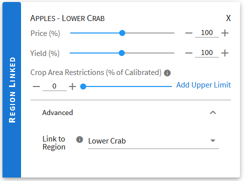

.. _CropModificationsDoc:

Crop Modifications
====================
.. contents::
    :local:

.. _CropModificationsDocOverview:

Overview
----------
Crop modifications are the second step in :ref:`creating an OpenAg model run <MakeModelRunsDoc>` and allow for adjustment
of crop-specific parameters. By default, crop modification :ref:`cards <CardsConceptSection>` apply to data for the crop within every
:ref:`region <RegionConceptSection>` where the crop is present, though it is possible to specify crop parameters per-region (see :ref:`RegionLinkedCropsSection`)

.. _CropModificationParametersSection:

Parameters
-------------

    A crop modification card, showing the three primary adjustments to crop data in OpenAg

Crop Cards support three parameters:

#. Price:
    OpenAg stores calibrated prices for each crop and region in dollars per ton ($/ton). You can use the controls on
    crop modification cards to increase or decrease the price of any or all crops by up to 20 percent relative to their
    calibrated values. For example, if we have crop A that sells for $1000/ton and crop B that sells for $5000/ton and
    you use the All Crops card to adjust prices up 20%, then crop A's price will be set to $1200 and crop B's price will
    be set to $6000.
#. Yield:
    Yield values, representing tons per acre of a crop, behave similarly to price values - you may adjust them up or down by
    as much as 20% relative to each individual crop's calibrated value for the model area. The yield slider does not
    apply to the :ref:`nonirrigated lands model <NonIrrigatedDoc>` because yield is an output of that model rather than an input.
#. Crop Area Restrictions:
    Crop area restrictions (or constraints) behave differently than the previous two items. Where the previous two are
    numerical inputs to the optimization model, crop area restrictions are hard constraints that *must* be satisfied
    for the model to successfully run. Crop area restrictions allow you to place limits on how much of any crop it takes
    out of production to exchange for another crop in any region. Additionally, you may place an upper limit on the
    potential growth of a crop or even force a reduction by setting an upper limit that is below 100%. Crop area restrictions
    are useful in scenarios where a low value crop and a high value crop are grown in the same region and the model run
    reduces resource availability. In most cases, the model will be willing to take significant amounts of the low
    value crop out of production in order to keep the high value crop in production. If you know that limited amounts
    of the low value crop will go out of production, or want to test the impact of a smaller reduction in the low value
    crop to free up resources for the higher value crop, then setting a low-end limit on that crop's crop area restriction
    limits the model's ability to remove it from production. Crop area restrictions are not used in the :ref:`nonirrigated lands model <NonIrrigatedDoc>`.

Crop area restrictions should be used with care. Since they create a hard constraint in the model, misconfiguration of
these constraints can lead to infeasible model runs. For example, setting all crops to a minimum crop area restriction
of 100% while reducing resource availability such as water or land is likely to result in an infeasible model run since
the model will not be able to take crops out of production to satisfy model conditions.

For a table showing which parameters apply in the irrigated and the nonirrigated models, please see :ref:`ModelsAvailableDoc`.

.. seealso::

    * :ref:`See how price and yield values are used in the irrigated land model <CropPriceYieldSection>`
    * :ref:`DiagnosingInfeasibleRunsSection`

.. _AutomaticAdditionCropModificationsSection:

Automatic Addition of Crop Modification Cards
------------------------------------------------

    Some crop cards may be automatically added, as shown here with the blue banner that says "Automatically Added"

While adjusting values for the :ref:`All Crops <AllRegionsAndAllCropsOverviewSection>` card, OpenAg will sometimes automatically add cards for specific crops for you.
It adds the cards because the settings on the All Crops card would make growing some crops economically infeasible - they
would lose money growing the crops in at least one region in the model. You may intend for that as an input, but in some cases you may not, so in order to
alert you to that condition and give you an explicit choice, the web application adds cards for crops before the settings
change to push the crop into losing money. You may further adjust the crop-specific settings if you wish, however.

Once created automatically, cards will not be removed automatically, even if you change the All Crops card so that the
crop-specific card is no longer needed. Instead, any time the All Crops setting would mean the crop loses money, the
crop-specific card will be unremovable in the application. Where the :code:`X` would be in the corner of the card it will
show a help tooltip explaining that the card cannot be removed. If you remove the card from the crop-selection dropdown,
it will be added back. If you adjust the All Crops card settings such that the card is no longer required, the card will
again be removable.

Automatically added crops can be identified by their blue banner at the top that says "Automatically added" and has a help
tooltip that is accessible by hovering over the icon to further explain what happened". If you make adjustments to a card
that was automatically added, the banner will disappear since you have now customized its settings, allowing you to at a
glance see which cards have been added without adjustment and which cards you have changed.

.. _RegionLinkedCropsSection:

Region-Linked Crops
----------------------

    Crop information can be specified per-region by "Region-linking" individual crop cards so that the parameters
    on the card apply only to the crop when grown in that region.

Typically, adding crop modification cards for specific crops results in changes to the values for that crop in every
region the crop is grown in.

.. _AdditionalReadingCropModificationsSection:

Additional Reading on Modifications
-------------------------------------------
* :ref:`ModificationsOverviewSection`
* :ref:`ModelInputHierarchyDoc`
* :ref:`RegionModificationsDoc`