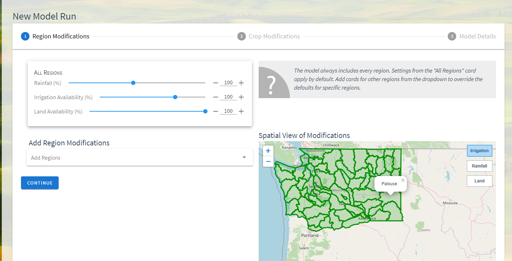
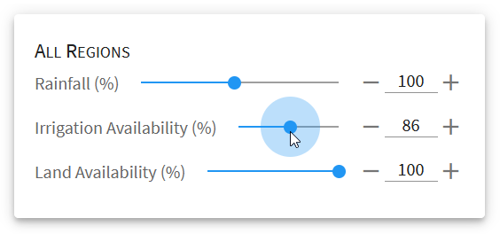
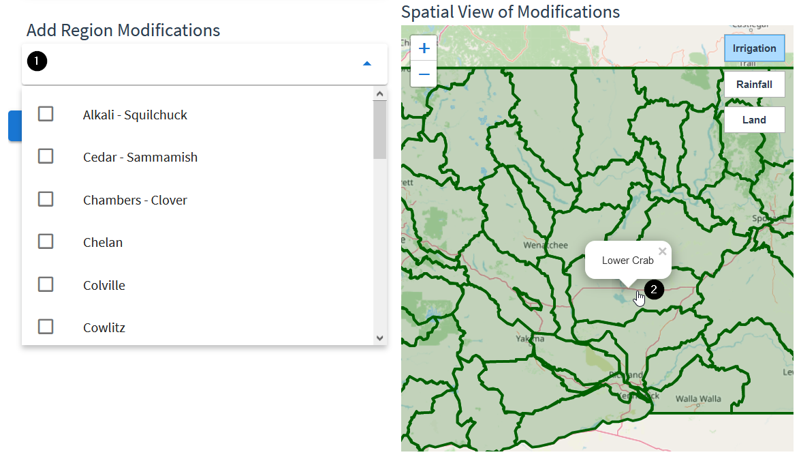
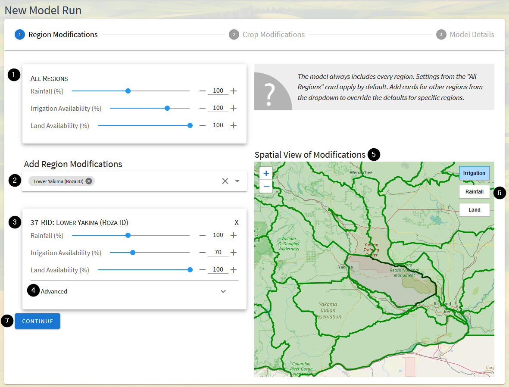
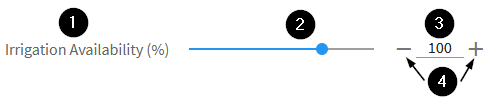

.. index::
    pair: model run; create

.. _MakeModelRunsDoc:

Creating Model Runs
==================================
By default, running the OpenAg model with no modifications will produce the output that most
closely aligns with observed conditions, called the "Base Case". The OpenAg application
is designed to allow you to create your own model runs, or scenarios, where you specify
deviations or changes in conditions compared with the base case. You provide these in the form
of two separate types of modifications to the model inputs and constraints: region modifications
and crop modifications.

.. todo:: This page needs some restructuring once everything is written - the adding cards section is redundant,
    and maybe those kinds of details go on another page

.. toctree::
    :maxdepth: 2
    :caption: In this section:

    region_modifications.rst
    crop_modifications.rst
    model_input_hierarchy.rst
    translating_common_scenarios.rst

On this page:

.. contents::
    :depth: 2
    :local:
    :backlinks: none

.. index::
    single: model run; create; overview

An Overview of Model Run Creation
-----------------------------------

Within the application, creating a model run has three steps:

#. Add :ref:`Region Modifications <RegionModificationsOverviewSection>`:
    Add adjustments to region-wide parameters either across the model or for specific regions in the :ref:`model area <ModelAreasDoc>`.
    Modifications for regions will always include irrigated water availability and total cropped land availability and may
    include rainfall, depending on the model area and available data. Information on
    :ref:`how to create region modifications <RegionModificationsOverviewSection>` is
    below and details on parameters, options, and interactions are on the :ref:`RegionModificationsDoc` page.
#. Add :ref:`Crop Modifications <CropModificationsOverviewSection>`:
    Add adjustments to crop-specific parameters, such as prices, yields, and crop area constraints. The crop parameters will apply to the crop
    in all region it is grown in, by default, though it is possible to :ref:`tie crop parameters to a specific region <RegionLinkedCropsSection>`.
    Information on :ref:`how to create crop modifications <CropModificationsOverviewSection>` is
    below and details on parameters, options, and interactions are on the :ref:`CropModificationsDoc` page.
#. Add Metadata and Review:
    The final step of creating a model run allows you to add a name, descriptive text, and to review a summary of inputs.

.. seealso::
    :ref:`ModelInputHierarchyDoc` for more information on how OpenAg determines which values to use when inputs overlap.

.. index::
    single: model run; create; modifications
    single: modifications; create
    single: create; modification

.. _ModificationsOverviewSection:

Overview of Modifications
---------------------------
When creating a new model run, most inputs are expressed as modifications relative to the base case. You can express
these modifications for all regions or all crops, or provide modifications for specific regions or specific crops.

By default, OpenAg preserves the base case, so a model run with no modifications will produce identical results to the
base case model run for the model area. All modification options default to 100%, meaning the application will keep
the value exactly as in the base case. Adjusting the value then means making an adjustment relative to that item's normal value,
rather than inputting an absolute value for the parameter. If you wish to input a specific quantity of a resource (e.g.
irrigation water availability), then you need to first convert it to a percentage by comparing it to the amount available
in the base case for the same unit of analysis, such as the individual region it applies to or all regions.

As a consequence of using relative values, for some scenarios, you will need to carefully consider your inputs. For example,
if you want to simulate a water transfer between two regions, it would be incorrect to increase one region by 10% and
decrease the other by 10% unless they both have the same amount of total available irrigation water. Instead, you would
need to determine how much water is available in each region, using either the Input Data Viewer or viewing the base case,
and then determine what percentage values for each region would indicate the same amount of water.

.. index::
    single: model run; create; all regions
    single: model run; create; all crops
    single: modifications; all regions
    single: modifications; all crops

.. _AllRegionsAllCropsSection:

All Regions and All Crops
___________________________

    The All Regions card with model parameters showing for all regions in the model

The most straightforward inputs in OpenAg are displayed by default in the form of the "All Regions" and "All Crops"
cards. The controls on these cards adjust the associated parameter for every region in the model area. Conceptually,
the All Regions and All Crops can be thought of as making an adjustment across the entire model domain. So adjusting
"irrigation availability" to 90% would produce a 10% cutback of irrigation water in every region within the model.

When setting values via the All Regions or All Crops cards, resources are not pooled between regions or crops and there
is no implicit trading between regions, though you can replicate that scenario. Instead, when you adjust values
on the All Regions or All Crops cards,
the model behaves as if an individual card was set up for each region or crop. In other words, optimization always
happens per region and the values are set explicitly for each region and crop combination, so changing water
availability in the all regions card, for example, will not produce water transfers between regions.

Adding Cards
-----------------
For more granular adjustments, OpenAg allows you to create modification cards for each region or crop in the model area.
Modification cards provide the same parameters as are on the All Regions or All Crops card, but they are specific to
the region or crop selected when creating the card.

    Cards can be added either by searching the Add Modifications dropdown or clicking on the map (regions only)

You may create cards in two ways:

1.
    From the dropdown menu under the Add Region Modifications or Add Crop Modifications heading. You may select one or
    deselect one or more regions from the list shown in alphabetical order. You may also type in the dropdown to search
    or filter the regions to one whose name you know.
2.
    For region modifications you may also click on the map to create a region modification card for the corresponding
    region. Since crop modification cards apply to the crop in all regions, there is no map to add crop modification cards.

.. _RegionModificationsOverviewSection:

Overview of Region Modifications
___________________________________

Region modifications are the first step in :ref:`creating an OpenAg model run <MakeModelRunsDoc>` and allow for adjustment
of region-specific parameters, such as irrigation, land area used for agricultural production, and rainfall (if configured
for the :ref:`model area <ModelAreaConceptSection>`).

The region modifications portion of the New Model Run page includes many components and options:

1. The :ref:`All Regions Card <AllRegionsAllCropsSection>`:
    The all regions card provides the ability to adjust model parameters for all regions within the model area. The
    parameters provided here will be used for every region, except those added as separate cards (see item 3).
2. The region selection box to add region modification cards:
    In order to provide more specific per-region parameters, add cards by clicking into this box and choosing the region
    name from the dropdown or typing into the box to search available regions. You can check the boxes next to multiple
    regions to add cards for many at once. Region cards may also be added by clicking on the map. Region modification
    cards will appear below this box as they are added.
3. :ref:`Region modification cards <RegionModificationsDoc>`:
    Adjust parameters for specific regions here. Any region with a modification card will use the parameters on the region-specific
    card as opposed to those on the All Regions card.
4. :ref:`Advanced region modification options <AdvancedRegionOptionsSection>`:
    Click on :code:`Advanced` in order to show options that change how the region is modeled.
5. The map view of the current configured modifications`
    The map view on the right side of the page changes color by region as input parameters are modified to give a sense
    for the impact of the current set of input parameters model-wide. Darker grey/black
    colors indicate lower percentage values and brighter greens indicate higher percentage values. The map only shows
    a single variable at a time and defaults to showing the irrigation water availability. Regions may be clicked on the
    map to add modification cards and hovered over to see their names.
6. Controls to change the map view's parameter:
    In the upper right of the map are buttons that change which region parameter is displaying on the map. To see the
    overall set of changes to another parameter, click the appropriate button here.
7. The continue button:
    Clicking here will finish the region modifications step and move on to creating crop modifications. You may return
    to region modifications again by clicking on "Region Modifications" near the top of the page.

.. seealso::
    For more details on working with region modifications, including information on specific choices and interactions,
    see :ref:`RegionModificationsDoc`.

.. _CropModificationsOverviewSection:

Overview of Crop Modifications
_________________________________

.. todo:: fill in

..
    .. figure:: cropimage.png

.. seealso::
    * :ref:`CropModificationsDoc`
    * :ref:`ModelInputHierarchyDoc`

.. _AdjustModificationParametersSection:

How to Adjust Modification Parameters
_______________________________________

Parameters on both region and crop modification cards can be adjusted in multiple ways. While each parameter allows
adjustment of percentages relative to calibrated values in the model, |project_name| provides three ways to input parameter
adjustments, depending on your preference.

#. Each parameter provides a label indicating which parameter the control adjusts
#. The parameter value can be input using a slider. Click and drag the circle on the slider to change the value. As you drag the slider, the value in the box on the right will change to indicate the current value
#. You can input and type directly into the box. The value will update once you click or tab away from the box, and the slider will update to reflect the change in the box
#. You can increment or decrement the value using the minus or plus signs on either side of the box, which will update the value in the box and adjust the slider value. These buttons allow you to drag the slider to get close to the value you want and then refine the value.

See :ref:`AdjustingCropAreaRestrictions` for usage of Crop Area Restrictions sliders, which have more capabilities.

Capabilities in the Application
---------------------------------
Though we have attempted to make the application as straightforward and user-friendly as possible, before creating a model run it is important
to spend time considering how to translate your scenario of interest into adjustments that the model accepts.

#. Water transfers within a region
#. Water transfers between regions
#. Climate change impacts
#. Reduced production
#. Salinity impacts
#. Crop mix changes

.. todo:: flesh out section stub

e.g. what can we actually change or control in the application

.. seealso::
    :ref:`TranslatingCommonScenariosDoc`
