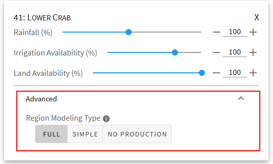

.. _RegionModificationsDoc:

Region Modifications
=====================

On this page:

.. contents::
    :local:

.. _RegionModificationsOverviewSection:

Overview
----------
Region modifications are the first step in :ref:`creating an OpenAg model run <MakeModelRunsDoc>` and allow for adjustment
of region-specific parameters, such as irrigation, land area used for agricultural production, and rainfall (if configured
for the :ref:`model area <ModelAreaConceptSection>`).

In addition to the differing parameters region modification :ref:`cards <CardsConceptSection>` apply differently
than :ref:`crop modification cards <CropModificationsDoc>` in that crop cards apply to the same crop in all regions where it is grown, but parameters on region cards
apply to all crops grown in one single region.

.. note::
    The region card parameters for land area and irrigation water
    availability can be thought of as providing both inputs *and* outputs to the model. The region card allows you to specify
    the total amounts available for each parameter within the region, and then the model apportions each resource (land, irrigation
    water) amongst the crops, resulting in the per-crop outputs for land and irrigation water in the region.

.. _RegionModificationsParametersSection:

Parameters
----------------
Region cards provide up to three parameters. Each parameter provides the ability to adjust values relative to their
calibrated inputs values and does not show absolute values in original units. All values are in percentages relative
to calibrated value.

#. Rainfall:
    The |project_name| :ref:`nonirrigated lands model <NonIrrigatedDoc>` relates crop yields to amount of rainfall and
    temperature by season. The rainfall parameter allows you to adjust the amount of rainfall for all regions or specific
    regions between 10% and 200% of the mean value during the calibration period for the model area. This parameter only
    shows in :ref:`model areas <ModelAreasDoc>` and regions that have nonirrigated lands. If the parameter is missing,
    either the model area doesn't support the nonirrigated model, or the region does not have sufficient nonirrigated lands
    in the dataset. See :ref:`IrrigatedDataSplitDoc` for more information on how |project_name| determines availability
    of nonirrigated lands.
#. Irrigation Availability:
    The irrigation availability parameter adjusts irrigation water available within each region as part of the
    :ref:`irrigated lands PMP model <IrrigatedPMPDoc>`.
#. Land Availability:
    text

.. seealso::
    :ref:`See how region parameters are used in the irrigated land model <WaterExchangeSection>`

Creating Region Modification Cards
------------------------------------
1. Search for region by name
2. Click on map

Map Capabilities
-------------------

clickable to add cards

shows total impact of modifications for a single parameter on the map

Currently does *not* react to region modeling type.

.. _AdvancedRegionOptionsSection:

Advanced Region Options
------------------------
When working with region cards, you have the option to change advanced settings by clicking on the
"Advanced" expansion panel at the bottom of the card. The advanced settings give you three options
that adjust how the region is modeled. Since each region is modeled independently, you can change these settings for any
given region without affecting the output of another region.

#. Full:
    The default behavior for most regions and model areas. When the Full option is selected, the region will be run
    through the :ref:`PMP model <IrrigatedPMPDoc>` and, when applicable, through the nonirrigated agricultural yield model.
#. Simple:
    In some cases, you may not want to make the assumptions that the full PMP model makes - in this case, the "simple"
    option prevents them from being modeled in the PMP formulation, and instead assumes a linear scaling of values based
    upon modifications in the input. See :ref:`SimpleModelingDoc` for more information on how the region will be modeled
    when choosing this option. As of June 2021, using the Simple model will still run the nonirrigaged model separately for
    crops and regions that have data available, but this behavior may change in the future.
#. No Production:
    Use this if you want to model the region as if it produced nothing over the model time period. In the
    San Francisco Bay Delta, for example, this can be useful for scenarios where an island floods and produces
    no agricultural output. An alternative is to model the region normally, but filter results in the output
    to remove the region, in case you want to assess results both with and without the region.

Note that these are high priority settings in that they take first precedence. A region held to base case will not
be affected by the crop modification settings you choose. Results will appear exactly as in the base case for that region,
while other regions will apply crop modifications as normal.

.. _DefaultAdvancedRegionOptionsSection:

Default Advanced Region Options
__________________________________
In some cases, when choosing a region, one of the advanced region options may show up as chosen by default for that region.
This occurs because some regions may have default modeling behaviors other than the full PMP model, based primarily on
data availability. Regions with very small acreages of agriculture are very sensitive to fluctuations in inputs and regions
with only one or two crop groups cannot be modeled with a PMP. In these cases, the region may show up with the :ref:`Simple
modeling option <SimpleModelingDoc>` chosen by default. You may change these values, but note that it may make the results
less reliable or result in an infeasible model run.

.. warning::
    It is important to note that these default behaviors apply to the regions even if you do not choose them for
    modifications. If a region has a default modeling behavior and you do not create a region modification card
    for it, then the default behavior will apply.

.. _AdditionalReadingRegionModifications:

Additional Reading on Modifications
-------------------------------------------
* :ref:`ModificationsOverviewSection`
* :ref:`ModelInputHierarchyDoc`
* :ref:`CropModificationsDoc`