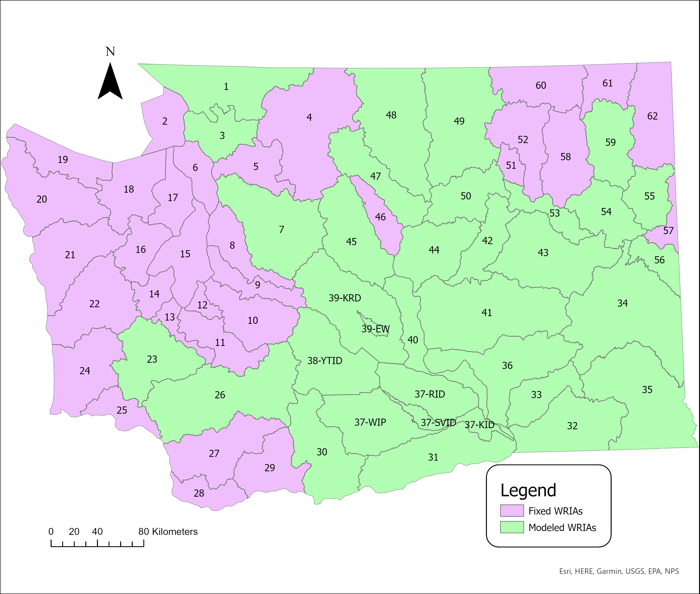

.. _WashingtonModelDoc:

The Washington State Model
===========================

.. _WashingtonModelOverviewSection:

Model Overview
------------------
Data collected for use in the model includes a variety of types and spans a decade (2008-2018), although only a selected
subset (2016-2018) is used in model calibration at this time. Spatial coverage of the model is nearly the entire state, with the
exception of some regions which lack the agricultural complexity to effectively model (see :ref:`FixedRegionsSection` for more information),
and the spatial scale of the model is a modified version of Washington's Water Resource Inventory Areas (WRIA).
Models are run at an annual scale, as sub-annual planting decisions cannot be captured using available data.

Model input data utilizes a crop grouping structure to retain sufficient resolution in outputs while
reducing data dependency. Initial land use surveys contain approximately 200 commodities that OpenAg groups into 14
categories for modeling. Each category is then assigned a proxy commodity to represent the economics and water needs
of the group. Proxies are assigned based on a combination of data availability and prominence in the overall land portfolio.

.. toctree::
    input_data_sources.rst

.. contents::
    :local:
    :depth: 2

Land Use and Crop Groups
---------------
Parcel-level land use data used in the model comes from the Washington State Department of Agriculture. The model excludes
semi-agricultural or fishery categories such as nursery plants, shellfish, and horticulture.
Spatial data for each year is first clipped to model designated regions. Then, crop commodities are grouped into the 14 crop
categories in the table below. Each category is assessed to determine the most significant
crop commodities considering a combination of both acreage and revenue, with the most significant made an economic and water
use proxy for other commodities in the same category. The proxy commodity's economic and water use data are used in place
of data for other commodities in the same category and all data are grouped together as one crop.

Spatial cropping data contains metadata pertaining to the type of irrigation of each parcel. This information
is used to split data between the :ref:`irrigated <IrrigatedPMPDoc>` and :ref:`non-irrigated <NonIrrigatedDoc>` models by
region. See :ref:`IrrigatedDataSplitDoc` for more information on how OpenAg splits data between the two models.

The following table shows the crops included in each crop group in OpenAg for the Washington model.
The pipe character :code:`|` splits separate commodities, so, for example in the "Bean" row, the first
commodity included as a bean is "Bean, Dry" and the second is "Bean, Garbanzo", etc. Any commodity not shown
in the table is not included in the model.

..
    comment
    This data came from Box\OpenAGWA\Task1_Database\Databases\Stepwise Databases\Other\Database_New_Regions_05042021\OpenAgWA_cropcodebridge_10172020.csv
    Reaggregated in Notepad++ with CsvQuery using the query

    SELECT Col1 as OpenAg_Crop, group_concat(Col2, "  |  ") as WSDA_Level_1 FROM THIS GROUP BY Col1

    Then dropped the wheat fallow, fallow, other, and the header row that was inserted

.. csv-table::
    :header: OpenAg_Crop,WSDA_Level_1

    APPLE,Apple
    BEAN,"Bean, Dry  |  Bean, Garbanzo  |  Bean, Green  |  Chickpea  |  Legume Cover  |  Lentil  |  Pea, Dry  |  Pea, Green  |  Pea/Vetch  |  Soybean"
    BLUEBERRY,Blueberry
    CANEBERRY,"Berry, Unknown  |  Caneberry  |  Cranberry  |  Currant  |  Strawberry"
    CHERRY,Cherry
    CORN,"Corn, Field  |  Corn, Sweet  |  Corn, Unknown"
    GRAIN,"Alfalfa Seed  |  Alfalfa, Seed  |  Barley  |  Bean Seed  |  Bean, Seed  |  Beet Seed  |  Beet, Seed  |  Bluegrass Seed  |  Bluegrass, Seed  |  Broccoli Seed  |  Broccoli, Seed  |  Bromegrass Seed  |  Bromegrass, Seed  |  Brussels Sprouts Seed  |  Brussels Sprouts, Seed  |  Buckwheat  |  Burnet Seed  |  Burnet, Seed  |  Cabbage Seed  |  Cabbage, Seed  |  Camelina  |  Canola  |  Carrot Seed  |  Carrot, Seed  |  Cauliflower, Seed  |  Cereal Grain, Unknown  |  Cilantro Seed  |  Cilantro, Seed  |  Clover Seed  |  Clover, Seed  |  Conifer Seed  |  Conifer, Seed  |  Corn Seed  |  Corn, Seed  |  Fescue Seed  |  Fescue, Seed  |  Flax  |  Flax Seed  |  Grass Seed  |  Grass Seed, Other  |  Grass, Seed  |  Misc. Grass Seed  |  Mustard  |  Mustard Seed  |  Mustard, Seed  |  Oat  |  Onion Seed  |  Onion, Seed  |  Pea Seed  |  Pea, Seed  |  Pepper  |  Potato Seed  |  Potato, Seed  |  Quinoa  |  Radish Seed  |  Radish, Seed  |  Reclamation Seed  |  Rye  |  Ryegrass Seed  |  Ryegrass, Seed  |  Safflower Seed  |  Safflower, Seed  |  Seed, Other  |  Seed, Unknown  |  Sorghum  |  Spinach Seed  |  Spinach, Seed  |  Sugar Beet Seed  |  Sugar Beet, Seed  |  Sunflower  |  Sunflower Seed  |  Sunflower, Seed  |  Swiss Chard Seed  |  Swiss Chard, Seed  |  Triticale  |  Wheat  |  Wildlife Feed  |  Yarrow Seed  |  Yarrow, Seed  |  Yellow Mustard"
    GRAPE,"Grape, Concord  |  Grape, Juice  |  Grape, Table  |  Grape, Unknown  |  Grape, Wine"
    HAY,"Alfalfa Hay  |  Alfalfa, Hay  |  Alfalfa/Grass Hay  |  Alfalfa/Grass, Hay  |  Barley Hay  |  Clover Hay  |  Clover, Hay  |  Clover/Grass Hay  |  Grass Hay  |  Grass, Hay  |  Hay/Silage , Unknown  |  Hay/Silage, Unknown  |  Oat Hay  |  Rye Hay  |  Sudangrass  |  Timothy  |  Triticale Hay"
    HOPS,Hops
    PASTURE,Pasture
    PEAR,Pear
    POTATO,Potato
    VEGETABLE,"Artichoke  |  Asparagus  |  Beet  |  Broccoli  |  Brussels Sprouts  |  Cabbage  |  Cantaloupe  |  Carrot  |  Cauliflower  |  Cucumber  |  Garlic  |  Kale  |  Kiwi  |  Leek  |  Lettuce  |  Market Crops  |  Melon, Unknown  |  Onion  |  Peanut  |  Pumpkin  |  Radish  |  Rhubarb  |  Rutabaga  |  Spinach  |  Squash  |  Sugar Beet  |  Tomato  |  Vegetable, Unknown  |  Watermelon"

Regions
----------

    Regions used in the Washington model along with how they are handled, as modeled regions, or
    fixed regions that are scaled linearly by default rather than modeled.

.. csv-table::
    :header: "Region Name", "WRIA Region ID"

    "Alkali - Squilchuck", "40",
    "Cedar - Sammamish", "8",
    "Chambers - Clover", "12",
    "Chelan", "47",
    "Colville", "59",
    "Cowlitz", "26",
    "Deschutes", "13",
    "Duwamish - Green", "9",
    "Elwha - Dungeness", "18",
    "Entiat", "46",
    "Esquatzel Coulee", "36",
    "Foster", "50",
    "Grand Coulee", "42",
    "Grays - Elochoman", "25",
    "Hangman", "56",
    "Island", "6",
    "Kennedy - Goldsborough", "14",
    "Kettle", "60",
    "Kitsap", "15",
    "Klickitat", "30",
    "Lewis", "27",
    "Little Spokane", "55",
    "Lower Chehalis", "22",
    "Lower Crab", "41",
    "Lower Lake Roosevelt", "53",
    "Lower Skagit - Samish", "3",
    "Lower Snake", "33",
    "Lower Spokane", "54",
    "Lower Yakima (Kennewick ID)", "37-KID",
    "Lower Yakima (Roza ID)", "37-RID",
    "Lower Yakima (Sunnyside Valley ID)", "37-SVID",
    "Lower Yakima (Wapato Irrigation Project)", "37-WIP",
    "Lyre - Hoko", "19",
    "Methow", "48",
    "Middle Lake Roosevelt", "58",
    "Middle Snake", "35",
    "Middle Spokane", "57",
    "Moses Coulee", "44",
    "Naches (Yakima-Tieton ID)", "38-YTID",
    "Nespelem", "51",
    "Nisqually", "11",
    "Nooksack", "1",
    "Okanogan", "49",
    "Palouse", "34",
    "Pend Oreille", "62",
    "Puyallup - White", "10",
    "Queets - Quinault", "21",
    "Quilcene - Snow", "17",
    "Rock - Glade", "31",
    "Salmon - Washougal", "28",
    "San Juan", "2",
    "Sanpoil", "52",
    "Skokomish - Dosewallips", "16",
    "Snohomish", "7",
    "Soleduc", "20",
    "Stillaguamish", "5",
    "Upper Chehalis", "23",
    "Upper Crab-Wilson", "43",
    "Upper Lake Roosevelt", "61",
    "Upper Skagit", "4",
    "Upper Yakima (Ellensberg Area)", "39-EW",
    "Upper Yakima (Kittitas RD)", "39-KRD",
    "Walla Walla", "32",
    "Wenatchee", "45",
    "Willapa", "24",
    "Wind - White Salmon", "29"

.. _FixedRegionsSection:

Fixed Regions
_________________

Supported Capabilities
------------------------
The Washington model supports both the :ref:`irrigated lands model <IrrigatedPMPDoc>` and the :ref:`nonirrigated lands
rainfall model <NonIrrigatedDoc>`. The nonirrigated lands model is not used for all regions or crops. Most modeled regions
include rainfall modeling but only four crops are used in rainfall modeling: grain, bean, hay, and corn.