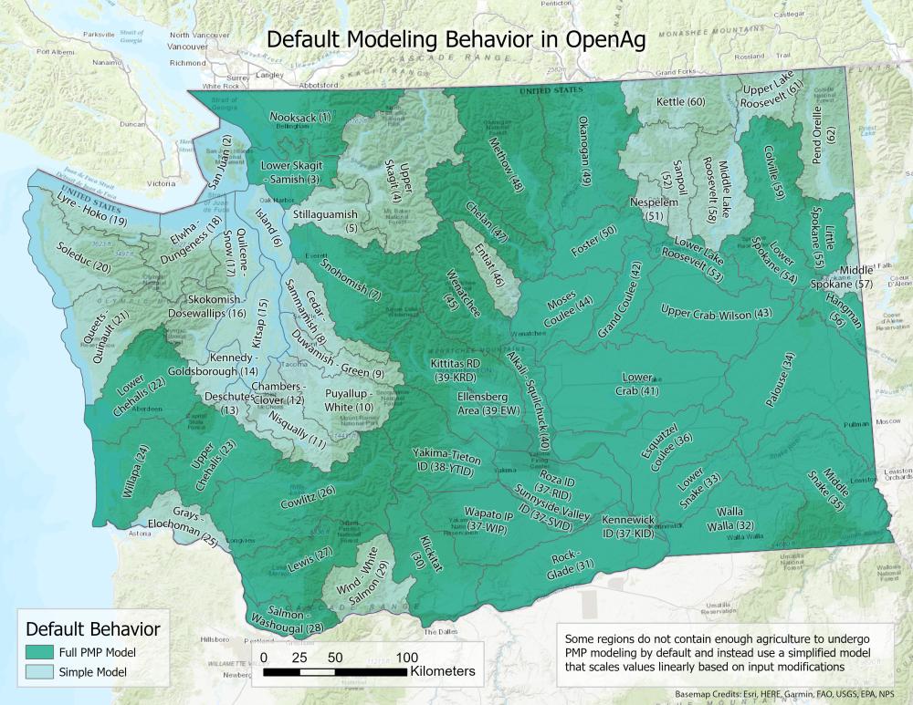

.. index::
    double: washington; model area

.. _WashingtonModelDoc:

The Washington State Model
===========================

.. _WashingtonModelOverviewSection:

Model Overview
------------------
Data collected for use in the model includes a variety of types and spans a decade (2008-2018), although only a selected
subset (2016-2018) is used in irrigated lands model calibration at this time. The nonirrigated lands model estimates
regression parameters based on the entire 2008-2018 dataset, but runs scenario modeling with respect to a 2016-2018 base case.
The nonirrigated lands model also includes only a subset of crops: grain, bean, alfalfa, and corn.

Spatial coverage of the model is nearly the entire state, with the
exception of some regions which lack the agricultural complexity to effectively model (see :ref:`FixedRegionsSection` for more information),
and the spatial scale of the model is a modified version of Washington's `Water Resource Inventory Areas (WRIA) <https://waecy.maps.arcgis.com/apps/webappviewer/index.html?id=996e6b21ae394cc3a3b63c6da0c3aa0a>`_.
Models are run at an annual scale, as sub-annual planting decisions cannot be captured using available data.

Model input data utilizes a crop grouping structure to retain sufficient resolution in outputs while
reducing data dependency. Initial land use surveys contain approximately 200 commodities that OpenAg groups into 14
categories for modeling. Each category is then assigned a proxy commodity to represent the economics and water needs
of the group. Proxies are assigned based on a combination of data availability and prominence in the overall land portfolio.
For example, imagine a category "vegetable" that includes onions, carrots, and tomato. If carrot is by far the most prominent
of the three (90% acreage) then we treat that entire category of land use as though it was carrots for the price,
yield, costs, and water demand. This approach is necessary because with so many commodities data and time are not available
to model every individual crop.

.. toctree::
    :maxdepth: 2

    input_data_sources.rst

.. contents::
    :local:
    :depth: 2

.. _WashingtonModelRegionsSection:

Regions
----------

    Regions used in the Washington model along with how they are handled by default, as :ref:`Full modeled regions <IrrigatedPMPDoc>`,
    or :ref:`Simple modeled regions <SimpleModelingDoc>` that are scaled linearly by default rather than PMP modeled.

.. csv-table::
    :header: "Region Name", "WRIA Region ID", "Default Modeling Behavior"

    "Alkali - Squilchuck", "40", "Full"
    "Cedar - Sammamish", "8", "Simple"
    "Chambers - Clover", "12", "Insufficient Ag Land"
    "Chelan", "47", "Full"
    "Colville", "59", "Full"
    "Cowlitz", "26", "Full"
    "Deschutes", "13", "Simple"
    "Duwamish - Green", "9", "Simple"
    "Elwha - Dungeness", "18", "Simple"
    "Entiat", "46", "Full"
    "Esquatzel Coulee", "36", "Full"
    "Foster", "50", "Full"
    "Grand Coulee", "42", "Full"
    "Grays - Elochoman", "25", "Simple"
    "Hangman", "56", "Full"
    "Island", "6", "Simple"
    "Kennedy - Goldsborough", "14", "Simple"
    "Kettle", "60", "Simple"
    "Kitsap", "15", "Simple"
    "Klickitat", "30", "Full"
    "Lewis", "27", "Simple"
    "Little Spokane", "55", "Full"
    "Lower Chehalis", "22", "Full"
    "Lower Crab", "41", "Full"
    "Lower Lake Roosevelt", "53", "Full"
    "Lower Skagit - Samish", "3", "Full"
    "Lower Snake", "33", "Full"
    "Lower Spokane", "54", "Full"
    "Lower Yakima (Kennewick ID)", "37-KID", "Full"
    "Lower Yakima (Roza ID)", "37-RID", "Full"
    "Lower Yakima (Sunnyside Valley ID)", "37-SVID", "Full"
    "Lower Yakima (Wapato Irrigation Project)", "37-WIP", "Full"
    "Lyre - Hoko", "19", "Simple"
    "Methow", "48", "Full"
    "Middle Lake Roosevelt", "58", "Simple"
    "Middle Snake", "35", "Full"
    "Middle Spokane", "57", "Simple"
    "Moses Coulee", "44", "Full"
    "Naches (Yakima-Tieton ID)", "38-YTID", "Full"
    "Nespelem", "51", "Simple"
    "Nisqually", "11", "Simple"
    "Nooksack", "1", "Full"
    "Okanogan", "49", "Full"
    "Palouse", "34", "Full"
    "Pend Oreille", "62", "Simple"
    "Puyallup - White", "10", "Simple"
    "Queets - Quinault", "21", "Insufficient Ag Land"
    "Quilcene - Snow", "17", "Simple"
    "Rock - Glade", "31", "Full"
    "Salmon - Washougal", "28", "Full"
    "San Juan", "2", "Simple"
    "Sanpoil", "52", "Simple"
    "Skokomish - Dosewallips", "16", "Simple"
    "Snohomish", "7", "Full"
    "Soleduc", "20", "Simple"
    "Stillaguamish", "5", "Simple"
    "Upper Chehalis", "23", "Full"
    "Upper Crab-Wilson", "43", "Full"
    "Upper Lake Roosevelt", "61", "Simple"
    "Upper Skagit", "4", "Simple"
    "Upper Yakima (Ellensberg Area)", "39-EW", "Full"
    "Upper Yakima (Kittitas RD)", "39-KRD", "Full"
    "Walla Walla", "32", "Full"
    "Wenatchee", "45", "Full"
    "Willapa", "24", "Full"
    "Wind - White Salmon", "29", "Simple"

.. _FixedRegionsSection:

Default Modeling Behavior
____________________________
Some regions in the Washington model use |project_name|'s :ref:`Simple model <SimpleModelingDoc>` by default in order to produce the best results.
These regions were identified as having a small amount of agriculture relative to the state's total, and using the Full
PMP model could result in wider fluctuations in results when significant input modifications are made. The table and map
above indicate how each region is handled by default in |project_name|.

The primary criteria used in determining how each region is handled is its proportion of agricultural land and revenues
relative to the state's totals. Region land and revenue were ordered by size and the regions that cumulatively resulted
in less than 5 percent of land use and less than 2 percent of revenue for the state were identified for further analysis.
Regions that fall into both groups use the Simple model by default, with the exceptions of WRIAS 22 (Lower Chehalis), 24
(Willapa), 27 (Lewis), and 28 (Salmon - Washougal), who had significant caneberry production that would have resulted in
more variability if left in the Simple model by default.

Supported Capabilities
------------------------
The Washington model supports both the :ref:`irrigated lands model <IrrigatedPMPDoc>` and the :ref:`nonirrigated lands
rainfall model <NonIrrigatedDoc>`. The nonirrigated lands model is not used for all regions or crops. Most modeled regions
include rainfall modeling but only four crops are used in rainfall modeling: grain, bean, hay, and corn.