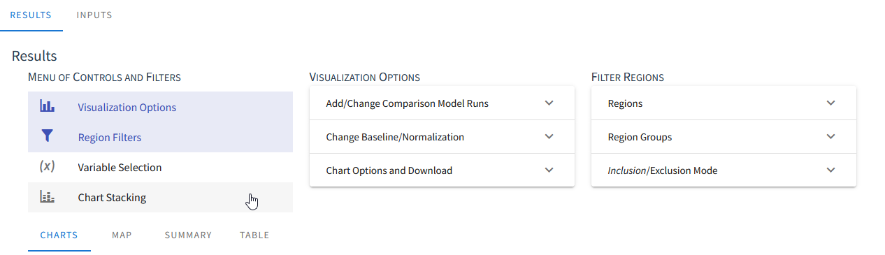

.. index::
    single: model run; view; results
    single: model run; results
    single: results

.. _ViewingModelRunResultsDoc:

Viewing Model Run Results and Raw Model Input Data
======================================================

Base Case
---------------

.. index::
    single: model run; data viewer;
    single: model run; data viewer; filters
    single: model run; results; filters

.. _DataViewerFiltersSection:

Filters
------------------

When viewing model data, either as model input data or in the results section of a model run page, the
application includes many filters and options for how the data are displayed. In order to keep the most
relevant information readily available, the application shows only one row of filters and tools
at a time and you may show or hide additional filters using the menu at the left. When all filters
fit on one row, the menu on the left will not show and all filters are displayed automatically.

General Features
___________________

Crop Filtering
___________________

Region Filtering
___________________

Irrigated and Nonirrigated Land Filtering
______________________________________________

Charts
--------------

Chart Controls and Options
_________________________________

Comparison Model Runs
++++++++++++++++++++++++

Baseline (Normalization)
+++++++++++++++++++++++++++++

Include or Exclude Regions
+++++++++++++++++++++++++++++

Chart Options
+++++++++++++++++++++++++++++

Tabular Display of Chart/Per-Crop Data
++++++++++++++++++++++++++++++++++++++++++++

Map View
------------------------

.. _SummaryResultsSection:

Summary View
-------------------

Table View
-----------------

.. contents::
    :local:

 
