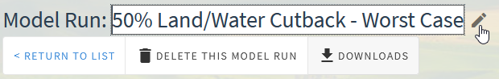
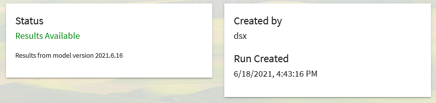
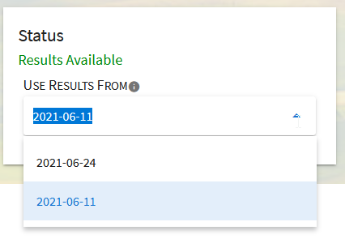

.. index::
    single: model run; find
    single: model run; view
    see: scenario; model run

.. _ModelRunDoc:

Viewing and Working with Model Runs
======================================

When viewing a model run page in OpenAg,

.. toctree::
    :maxdepth: 2
    :caption: In this section:

    ../ListModelRuns/list_model_runs.rst
    model_run_inputs.rst
    data_viewer.rst

On this page:

.. contents::
    :local:

.. index::
    single: model run; view; sections
    double: model run; delete
    single: model run; downloads; results
    single: downloads; model run results
    single: results; model run; downloads
    single: model run; downloads; inputs
    single: inputs; model run; downloads
    single: downloads; model run inputs
    single: model run; metadata; description
    double: model run; description
    single: model run; metadata
    single: model run; metadata; status
    double: model run; status
    seealso: parameters; inputs
    single: model run; inputs; table
    single: model run; inputs; scatterplot
    single: model run; infeasibilities
    triple: model run; results; chart
    triple: model run; results; table
    triple: model run; results; summary
    triple: model run; results; map

Model Run Page Sections
--------------------------
When viewing a model run, the page will have the following options and sections. Nested items indicate tabs or buttons
available within another item.

#. Delete
#. Downloads
    * Results
    * Inputs
#. Description
#. Status
#. Other Metadata
#. Inputs
    * Region Modifications
        * Table
        * Scatterplot
    * Crop Modifications
        * Table
        * Scatterplot
#. Infeasibilities (not always shown)
#. Results
    * Charts
    * Map
    * Summary
    * Table

.. index::
    double: model run; delete

Deleting a Model Run
----------------------------
To delete a model run while viewing it, click the :code:`Delete this model run` button with the trash can icon near the
top of the page. It will then change to say :code:`Click to confirm deletion` for five seconds. If you click it again,
the model run will be permanently and irreversibly deleted. If you do not click it again, it will change back to its
original state and will remain available for viewing. Model runs may also be deleted from the :ref:`model run listing <FindingModelRunsDoc>` page.

.. index::
    single: model run; downloads; results
    single: downloads; model run results
    single: results; model run; downloads
    single: model run; downloads; inputs
    single: inputs; model run; downloads
    single: downloads; model run inputs

Downloading Inputs or Results
----------------------------------
Model run parameter inputs and results may each be downloaded as `Comma Separated Values (CSV) <https://www.howtogeek.com/348960/what-is-a-csv-file-and-how-do-i-open-it/>`_
files from the :code:`Downloads` menu at the top of the page. From that menu, the following items are available as CSVs:

* Results for irrigated lands
* Results for nonirrigated lands (when configured)
* :ref:`Region modification <RegionModificationsOverviewSection>` inputs
* :ref:`Crop modification <CropModificationsOverviewSection>` inputs

.. index::
    single: model run; metadata; description
    double: model run; description
    single: model run; metadata

Changing the Model Run Name or Description
--------------------------------------------

    Editing the title of a model run by clicking the edit icon next to the title

Model run names and descriptions may be edited by clicking the pencil :code:`edit` icon next to the model run name
or the Description header, or by clicking directly on the text itself. When editing, the background of the text will
be white and it will have a darker border around the edge. Change the title or description to the desired value, then
click or tab away from the field to change focus and save the changes. If the change is successful, a notification
bar will pop up at the top of the page alerting you it saved the changes successfully. If it is unsuccessful, then the
title or description will be reverted to their old values.

.. index::
    single: model run; metadata
    single: model run; metadata; status
    double: model run; status

Model Run Status Messages and Metadata
----------------------------------------

    The model run status card with the model version used for the model run and the metadata card showing the name
    of the user that created the model run and the date and time it was created.

When viewing a model run, you may see three main status messages and one modified status message:

* Waiting
    The model run has not yet started. You may encounter this if you have queued up many runs, or if others are working
    at the same time and the server lacks capacity to run your model immediately
* Running
    The model run is currently running. Model runs typically take between 10 seconds and a few minutes. If your model
    run has been in the running state for longer than 10 minutes, it may have stalled or is being repeatedly restarted
    and you should :ref:`reach out to the |project_name| team <SuggestionsBugsContributionsSection>`.
* Results Available (Complete)
    The model run has completed running and results are loaded and available for viewing. When this status is shown,
    the application will show results by default instead of the inputs.
* Results Available - Contains Infeasibilities
    The same as :code:`Complete`, but warning that some regions had infeasible results. For more information on
    infeasibilities, see :ref:`InfeasibilitiesSection`. You may wish to create a new version of this model run
    to address the infeasibilities as the total results may be invalid.

Model runs that are either :code:`Waiting` or :code:`Running` check for updates every 10 seconds and the page will
update automatically without refreshing. While in the :code:`Waiting` or :code:`Running` states, |project_name| shows
the model run's inputs. If the model run completes, the page will change from showing the model run
inputs to showing the results, though the inputs tab is still available to access.

Metadata
_________________
Additional metadata available includes the model version used to run the model, the name of the user that created the
model, and the date and time the model run was created. The version of the model is provided in case it is needed for
additional reporting. It may change between model runs as the application is updated.

.. index::
    single: model run; results; multiple
    single: results; multiple

.. _MultipleResultsSetsSection:

Multiple Results Sets
_________________________

    The dropdown menu allowing selection of the results set to visualize on the page

In some cases, a model run may have multiple sets of results. This situation typically occurs when the |project_name|
model is updated in a way that impacts model results. In that instance, all existing model runs are re-run, and will gain
an additional set of results that will display by default. Typically, only the most recent set of results that is shown
by default is valid. But all previous sets of results are kept so that you can change to viewing them and understand
what impact the update to the model has on any interpretations you may have had of the previous results.

If multiple sets of results are available, a dropdown menu will appear below the status text on the page and will allow
you to select the date each set of results became available to display that set of results. Information shown on the rest
of the page will immediately update based on the selected results set. If the dropdown is not visible, then the model
run only has a single set of results.

Inputs
----------
See :ref:`ViewingModelRunInputsDoc` for complete documentation on viewing inputs.

Results
------------------------------
See :ref:`ViewingModelRunResultsDoc` for complete documentation on model run results

.. _InfeasibilitiesSection:

Infeasibilities
-------------------
