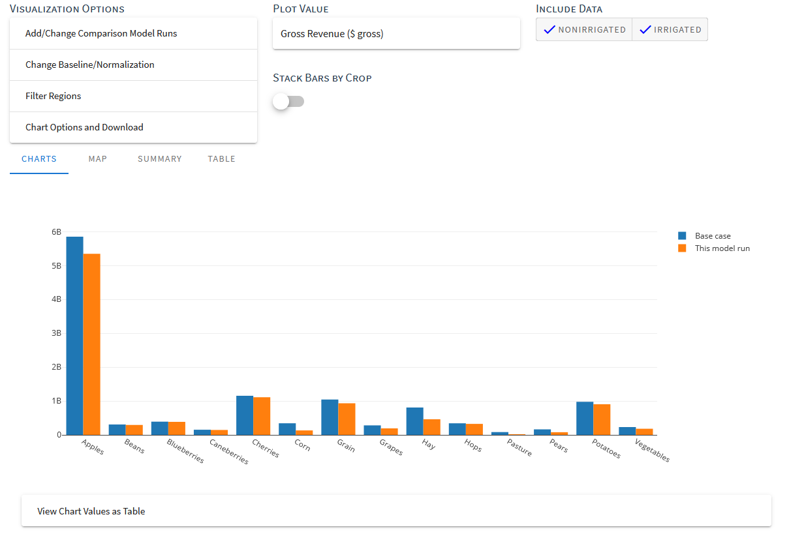

|project_name| Documentation
======================================

|project_name| is a web application and API for agricultural land use scenario analysis, especially focusing on drought assessment and
hydroeconomic decisions. It includes user choices for changing economic conditions, yield, land, and water policies and
helps users understand impact of water reductions and recognize potential drought responses including changes in
regional cropping patterns, water use, gross revenues, employment and value added.

|project_name| currently models two areas: :ref:`the State of Washington <WashingtonModelDoc>` and the
:ref:`Sacramento-San Joaquin River Delta <SacramentoSanJoaquinModelDoc>`. The model subdivides each :ref:`model area <ModelAreasDoc>`
into a set of regions with input data that are modeled independently.

.. toctree::
    :maxdepth: 1
    :caption: Documentation Contents:

    core_concepts.rst
    Dapper/dapper.rst
    ModelRuns/model_runs.rst
    MakeModelRun/make_model_run.rst
    InputDataViewer/input_data_viewer.rst
    Settings/settings.rst
    Troubleshooting/troubleshooting.rst
    Changelog/changelog.rst
    genindex.rst

Documentation Downloads and PDF
----------------------------------

* `Download PDF <https://openag-docs.readthedocs.io/_/downloads/en/latest/pdf/>`_
* `Download HTML <https://openag-docs.readthedocs.io/_/downloads/en/latest/htmlzip/>`_
* `Download EPub <https://openag-docs.readthedocs.io/_/downloads/en/latest/epub/>`_

.. _SuggestionsBugsContributionsSection:

Suggestions, Bugs, or Contributions to the Documentation
-------------------------------------------------------------

* If you have a suggestion for the documentation or a question not answered in the documentation, please `start a discussion on GitHub <https://github.com/ucm-openag/OpenAg_Docs/discussions/categories/ideas>`_.
* If you identify a bug, please `reach out on GitHub to file an issue <https://github.com/Water-Systems-Management-UCM/Waterspout/issues>`_.
* If you need to `get in touch with the development team otherwise, please use this form <https://wsm.ucmerced.edu/contact-us/>`_.

.. index::
    single: citation; suggested

Suggested Citation
--------------------
Nicholas Santos, Spencer Cole, Anna Rallings, Alex Guzman, José M. Rodríguez-Flores, Alvar Escriva-Bou, Joshua Viers, and Josué Medellín-Azuara. OpenAg Documentation. 2021. https:///openag-docs.readthedocs.io

